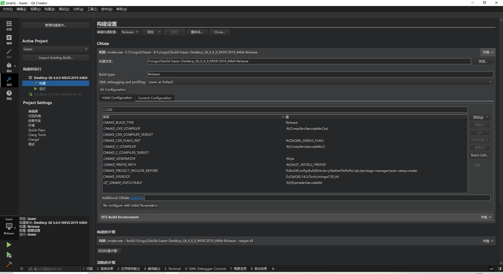

<h1 align="center">
  <br>
</h1>

<p align="center">
  <b>⭐Gazer⭐</b> 是一个免费的开源软件，适用于<b>反恐精英2.0</b>的游戏作弊。
</p>

<p align="center">
  🚧该软件仅为个人学习所开发，切勿用于不正当用途，产生的一切后果均由使用者自行承担。🚧
</p>

<p align="center">
<a href="https://en.wikipedia.org/wiki/C%2B%2B"></a>
<a href="https://store.steampowered.com/app/730/CounterStrike_2"></a>
<a href="LICENSE.txt"></a>
</p>

## 🦾 让我们开始吧

+ 进到`Releases`下进行下载

+ 解压后进到目录并以<b>管理员身份运行</b> `Gazer.exe`

或者

+ 克隆`Gazer`到你的本地

```SHELL
git clone https://github.com/RichaoWang/Gazer.git
```

+ 编译

```
git clone https://github.com/RichaoWang/Gazer.git
cd Gazer
mkdir build
cd build
cmake -DCMAKE_PREFIX_PATH=<YOUR_QT_SDK_DIR_PATH> -DCMAKE_BUILD_TYPE=Release -GNinja <PATH_TO_THE_REPOSITORY>
cmake --build . --config Release --target all --parallel
```

+ 当然，你也可以使用 (`Qt Creator` 或者 `CLion`) 去打开`Gazer`。 (仅支持 **CMake**编译工具，由**MSCV**编译器构建)。

* `qt_creator`

<div align=center>
  
</div>

* `clion`

<div align=center>
  
</div>

+ 编译&执行

+ 撒花🎉

## 📸 部分截图
<div align=center>
  
</div>

<div align=center>
  
</div>


## 👍 参考&致敬
+ [**__FluentUI__**](https://github.com/zhuzichu520/FluentUI) 这是一个漂亮的Fluent组件库，使用QML插件开发的。
+ [**__CS2_External__**](https://github.com/TKazer/CS2_External) CS2 Cheat基础。
+ [**__AimStar__**](https://github.com/CowNowK/AimStar) 一个完整并开源且不断集成与更新的CS2 Cheat项目，有很多新的特性。

## 🧾 记录
| Date  |Detail|Notes / Demos|
|:-----:|:----:|:----:|
| 暂无... |暂无...|暂无...|
| 暂无... |暂无...|暂无...|


## 🔐 许可证
`Gazer`使用宽松的 [MIT License](./License) 协议，始于开源，拥抱开源。